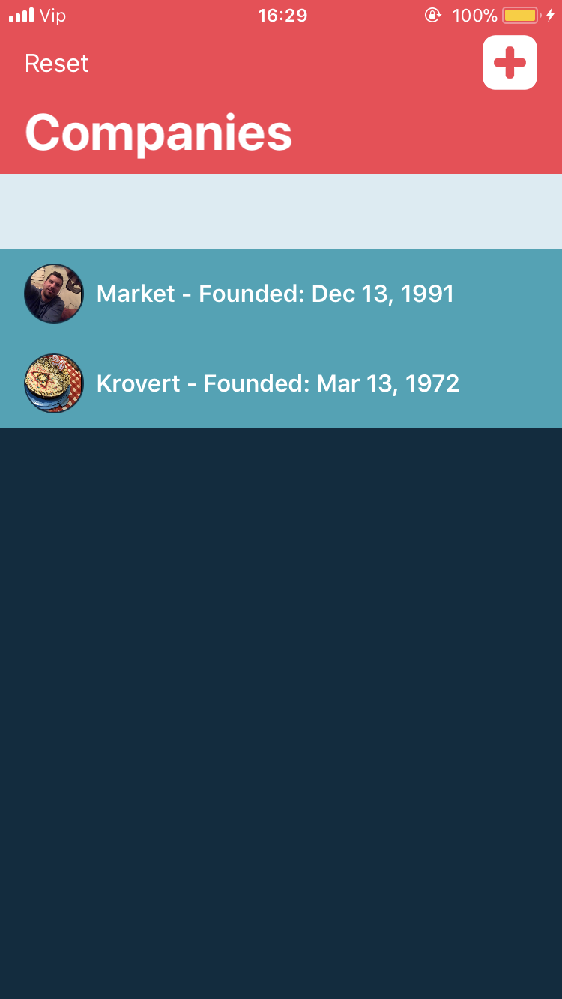
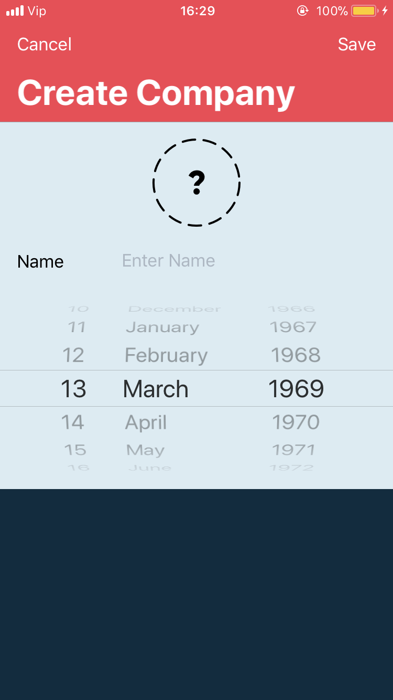
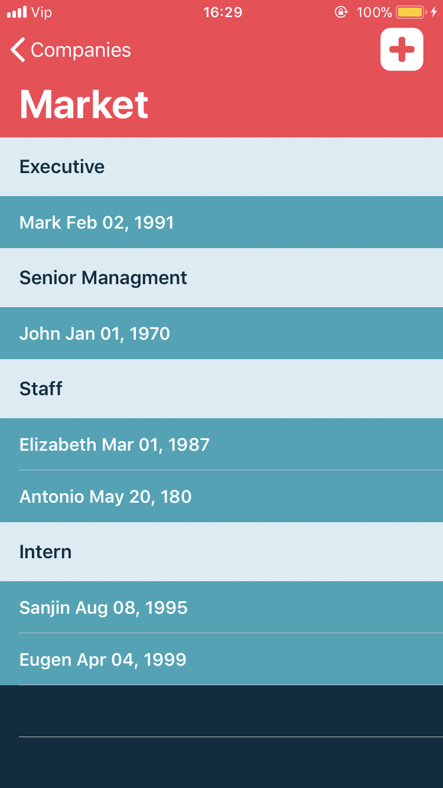
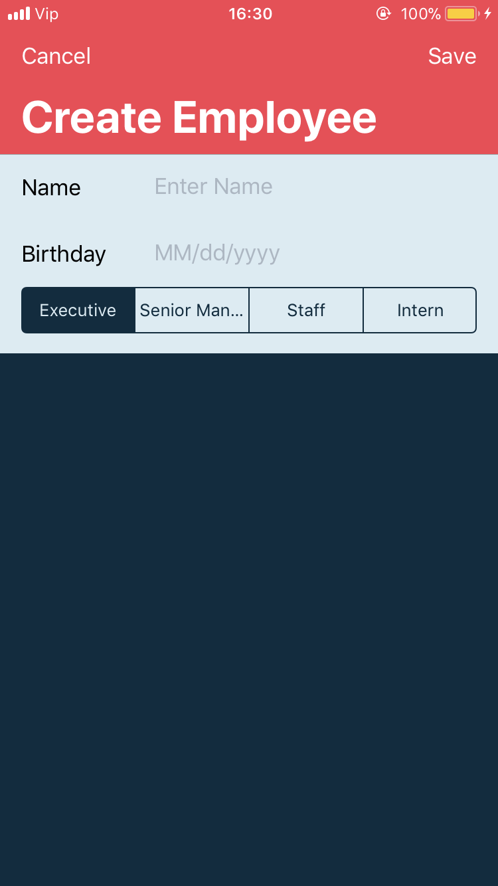

# TrainingCoreData

Company-Employee app for exploring workflow of CoreData.

#
Company screen:
- list of registrated companys
- auto refresh list by pulling down, fetching JSON and saving in CoreData
- delete all companies in CoreData
- add company button

   

#
Employees screen:
- list of employees inside of specific company
- add specific employee 

   
#
Core Features:
- AutoLayout with code
- Implementing CRUD (Create, Reed, Update, Delete) in CoreData
- CoreData migration (v1 to v1.5/2 etc, update attribute type)
- Parsing JSON into CoreData
- Multithreading

